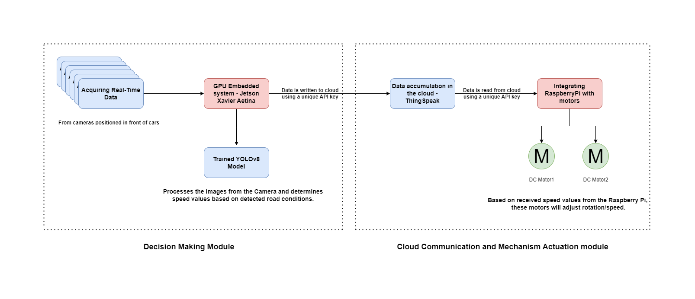

# Path-Pilot

Welcome to our repository dedicated to pioneering advancements in the realm of Self-Adaptive Speed and Mode Control using Instance Road Segmentation. As the name suggests, our endeavor is to harness real-time road segmentation to dictate adaptive speed and mode adjustments for vehicles, enhancing safety and optimizing travel efficiency. We have anchored our project on the rich and diverse Indian driving dataset, ensuring our solutions are tailored to address the unique challenges posed by the multifaceted driving conditions in India. Within this repository, you'll find scripts that underpin our methodology, making it a comprehensive resource for those keen on exploring or building upon this innovative intersection of road segmentation and adaptive vehicular control. 
## Contents

### Decision Making Module
This module is the brain of our system and has been developed in three versions:

1. **First Version**: This version encompasses segmentation using image processing techniques. Central to our approach is the innovative use of polygon tensors, a method that offers enhanced precision in dissecting and interpreting real-time imagery. By leveraging these tensors, our system achieves a heightened granularity in segmentation, making it possible to distinguish intricate details and patterns that are often missed with conventional methods. 
2. **Second Version**:  In this version, we've incorporated a pivotal enhancement: the assignment of speeds according to recognized golden standards. By synergizing these meticulous speed benchmarks with our segmentation insights, we've achieved a system that not only understands the road dynamics through segmentation but also knows the optimal speed to recommend for any given scenario. 
3. **Third Version**: For the final adaptation, we retained only the essential segmentation coupled with the desired threshold speeds. Subsequently, these values are sent to the ThingSpeak cloud for further processing using a unique API Key.

### Cloud Communication and Mechanism Actuation Module
In this module, dual motor speed control is facilitated using Raspberry Pi. The data values for this operation are fetched from ThingSpeak.

## Methodology

## Folder Structure
- final_folder
  - code
    - decision_making_module
      - First Version
      - Second Version
      - Third Version
    - Cloud_Communication_and_Mechanism_Actuation_module
  - demo
